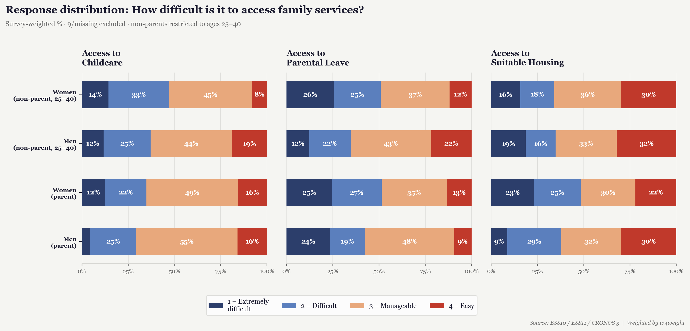
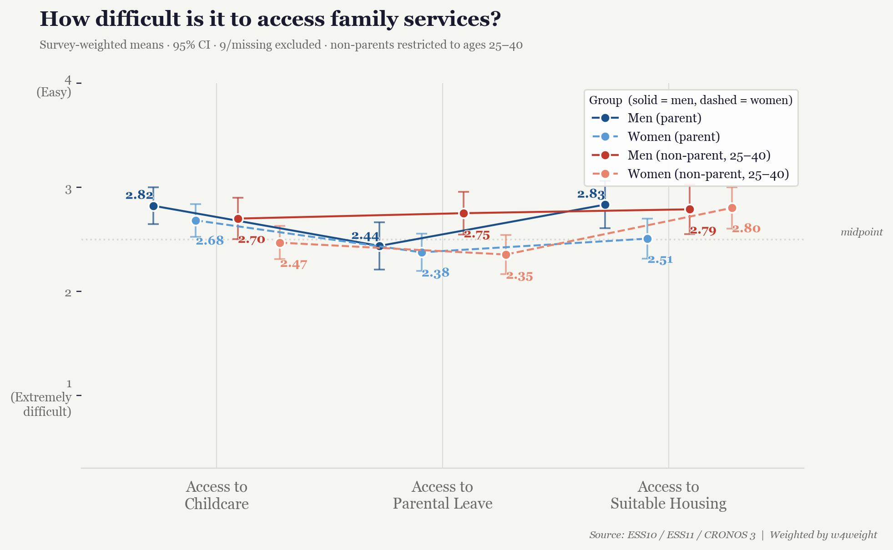
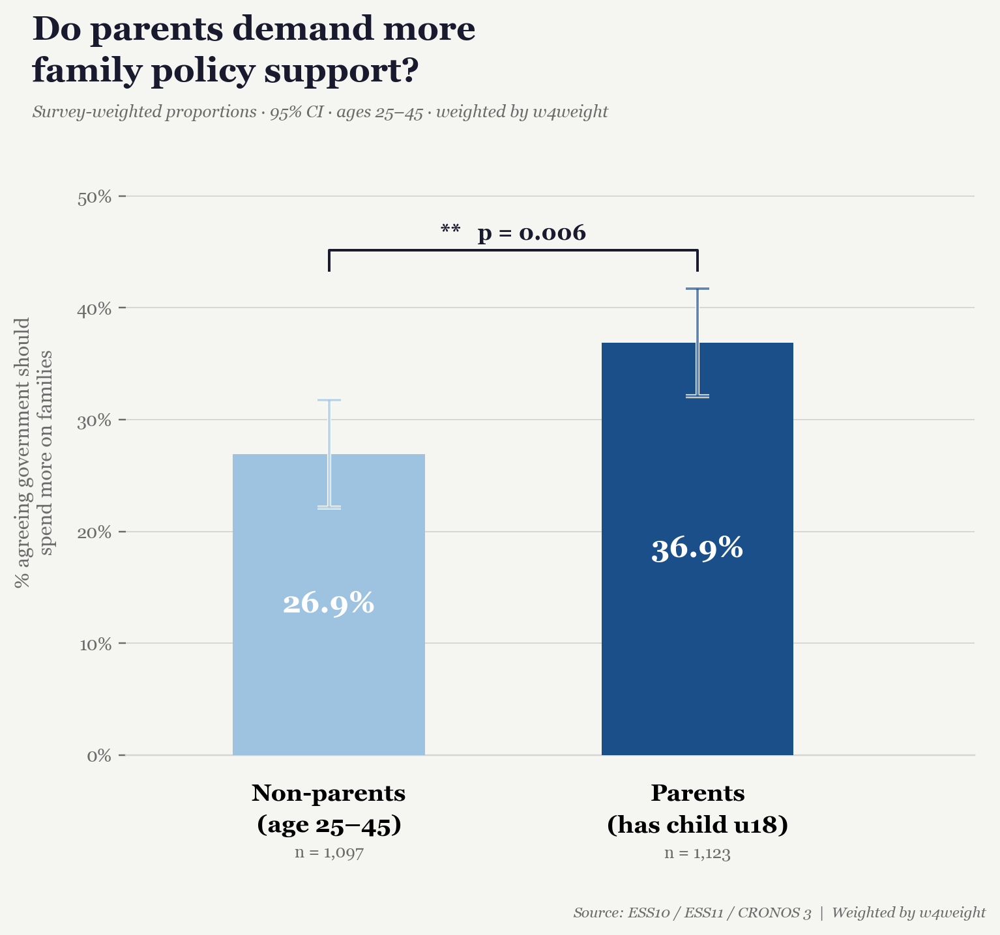

::: {style="font-size: 0.65em; color: #555; margin-bottom: 1.5em;"}
{style="vertical-align: middle; margin-right: 6px;" width="29" height="10"} This work is licensed under [CC BY 4.0](https://creativecommons.org/licenses/by/4.0/).
:::

# Policy Brief: Barriers to family formation - pathways to access

```{r, include=FALSE}
library(citr)
```

## Summary

This policy brief gives recommendations based on our background paper [@zotero-item-1478] (and other literature) short sum of recommendations and results. This analysis is based on questions in the Cross-National Online Survey 3 (CRONOS-3) Project [@europeansocialsurveyeuropeanresearchinfrastructureessericCRONOS3Wave12025; @europeansocialsurveyeuropeanresearchinfrastructureessericCRONOS3Wave22025; @europeansocialsurveyeuropeanresearchinfrastructureessericCRONOS3Wave32025; @europeansocialsurveyeuropeanresearchinfrastructureessericCRONOS3Wave42025; @europeansocialsurveyeuropeanresearchinfrastructureessericCRONOS3Wave52025] and data from the European Social Survey (ESS) Round 10 [@europeansocialsurveyericessericEuropeanSocialSurvey2022a; @europeansocialsurveyeuropeanresearchinfrastructureessericESS10IntegratedFile2025] and ESS Round 11 [@europeansocialsurveyeuropeanresearchinfrastructureessericESS11IntegratedFile2026]. We primarily focus on questions in the survey that assess access to housing, childcare, and parental leave if the person answering imagines having another child in the next three years. This tells us how the perception of the access now could shape future decisions about having a child. We mainly focus on the age group 25-40 as the main demographic for having children. Meta-level evidence from the OECD suggests that there is a positive relation between childcare spending and parental leave with fertility. [@FertilityEmploymentFamily2023]. For ease of annotations on the graphs, parents are defined as individuals living with their child under 18 (includes foster, adopted, and stepchildren), while non-parents are those not living with a child. Introduction

**The challenges:**

-   Demographic change across Europe as problem, low birthrates [@zotero-item-1478; @mateos-planasDemographicTransitionEurope2002].

-   Perceived barriers for accessing childcare, suitable housing and parental leave for having a child in the next three years [@zotero-item-1478; @europeansocialsurveyeuropeanresearchinfrastructureessericCRONOS3Wave12025]

**The questions:**

*How difficult is it to access family services?* - Based on CRONOS-3 question on access to satisfactory child childcare, suitable housing and parental leave for another child in the next three years [@europeansocialsurveyeuropeanresearchinfrastructureessericCRONOS3Wave52025].

*Do parents demand more family policy support? -* Based on CRONOS-3 Question where participants mark that their government should spend more on family policies [@europeansocialsurveyeuropeanresearchinfrastructureessericCRONOS3Wave52025].

## Data Insights



Our analysis shows that perceived barriers to accessing family services when considering having a child in the next three years are still consistently present across the 11 European countries (Austria, Belgium, Czechia, Finland, France, Hungary, Iceland, Poland, Portugal, Slovenia, and the United Kingdom) featured in the analysis.

{fig-align="left"}

Here we can see a consistent trend of women perceiving worse conditions of access, including childcare (β = -0.298\*\*\* to -0.268\*\*\*), parental leave (β = -0.316\*\*\* to -0.247\*\*), and housing (β = -0.209\* to -0.156+). High income is a significant positve predictor for all categories, but especially strong for housing (β = 0.707\*\*\*). Country-level variation is also pronounced, with Iceland showing strongly positive evaluations of parental leave (β = 0.763\*\*\*) and France and Portugal showing significantly lower childcare evaluations (β = -0.348\*\*, β = -0.570\*\*\* respectively).

{fig-align="left"}

There is a significant gap of support for government policy for those with children in their household (parents) versus those without (non-parents). Which we also confirmed in the regression results. Additionally, income plays a nuanced role, with middle incomes being less supportive than low- or high-income groups.

## Policy Recommendations

1.  Focus on structural change rather than symbolic change: Improving access requires removing barriers. We identified the importance of structural barriers for perceived family access to housing, childcare and parental leave. This means removing barriers to access in practice, whether that is through closing information gaps, removing bureaucratic hurdles or adding government support.

2.   Follow the role model: We already have positive examples in the European context, they show that people can feel more security about conditions around starting a family.

3.  Housing policy as a bottleneck: In our analysis we found that housing policy matters quite a lot. Perceived access to suitable housing for having a child in the next three years, is strongly associated with having high income,

4.  Address women insecurities directly: Since women are more concerned about security, they should be addressed directly in policy.

## For Data Enthusiast

Do you want to build on this analysis? Check out <https://github.com/Ravenscraven/Datathon>. You can find our full analysis using R, or build on our visualization done in Python.

## Bibliography
